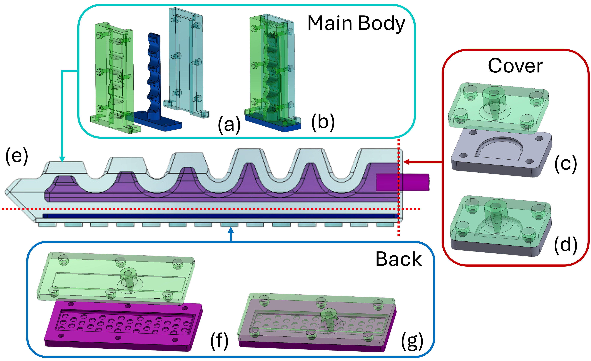
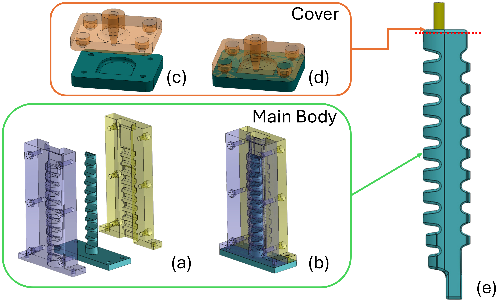

# sav_gripper
This project regulates the soft gripper's pressure and employs a feed-forward proportional control strategy. Notably, the feed-forward proportional control only sets the PWM signal for the air pump. At the same time, the PWM command of the flight controller directly determines the digital signals for activating solenoid valves.

For details, please take a look at this conference paper: [A Modular Pneumatic Soft Gripper Design for Aerial Grasping and Landing](https://ieeexplore.ieee.org/abstract/document/10521918) 

If you take this project as a reference in your research, please kindly cite the following reference:
```
@INPROCEEDINGS{10521918,
  author={Cheung, Hiu Ching and Chang, Ching-Wei and Jiang, Bailun and Wen, Chih-Yung and Chu, Henry K.},
  booktitle={2024 IEEE 7th International Conference on Soft Robotics (RoboSoft)}, 
  title={A Modular Pneumatic Soft Gripper Design for Aerial Grasping and Landing}, 
  year={2024},
  volume={},
  number={},
  pages={82-88},
  keywords={Gears;Shape;Service robots;Grasping;Soft robotics;Regulation;Grippers},
  doi={10.1109/RoboSoft60065.2024.10521918}}
```

## Moulds for soft gripper *without* inextensible layers
Please feel free to download the STL files here: [Moulds_gripper_without_tpu.zip](https://github.com/Athenachc/sav_gripper/blob/main/Moulds_gripper_without_tpu.zip)



## Moulds for soft gripper *with* inextensible layers
Please feel free to download the STL files here: [Moulds_gripper_tpu.zip](https://github.com/Athenachc/sav_gripper/blob/main/Moulds_gripper_tpu.zip)  
For the details of the application of this soft gripper, please see this preprint: [Aerial Grasping with Soft Aerial Vehicle Using Disturbance Observer-Based Model Predictive Control
](https://arxiv.org/abs/2409.14115)


