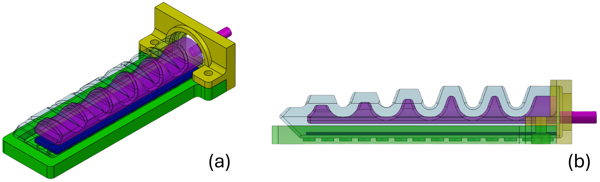

# sav_gripper
## Pneumatic soft gripper control
This project regulates the soft gripper's pressure and employs a feed-forward proportional control strategy. Notably, the feed-forward proportional control only sets the PWM signal for the air pump. At the same time, the PWM command of the flight controller directly determines the digital signals for activating solenoid valves.

For details, please take a look at this conference paper: [A Modular Pneumatic Soft Gripper Design for Aerial Grasping and Landing](https://ieeexplore.ieee.org/abstract/document/10521918) 

If you take this project as a reference in your research, please kindly cite the following reference:
```
@INPROCEEDINGS{10521918,
  author={Cheung, Hiu Ching and Chang, Ching-Wei and Jiang, Bailun and Wen, Chih-Yung and Chu, Henry K.},
  booktitle={2024 IEEE 7th International Conference on Soft Robotics (RoboSoft)}, 
  title={A Modular Pneumatic Soft Gripper Design for Aerial Grasping and Landing}, 
  year={2024},
  volume={},
  number={},
  pages={82-88},
  keywords={Gears;Shape;Service robots;Grasping;Soft robotics;Regulation;Grippers},
  doi={10.1109/RoboSoft60065.2024.10521918}}
```
## Fabrication - preparation
1. Combine equal amounts (e.g. 25 g) of liquid parts A and B of Smooth-on Dragon Skin 30 (Pot life: 45 min; Cure Time: 16 hrs).
2. Mix the liquid rubber contents thoroughly. It is better to mix them for 3 minutes to ensure that you scrape the sides and bottom of the mixing container.
3. Do Deubbling (Vacuum pressure: -0.1 MPa; diameter of the vacuum barrel: 20 cm; 4-L vacuum pump). 
4. Then your rubber mixture is ready to be poured or injected into the mould.

### Debbling steps
1. Put the rubber container with well-mixed rubber into the vacuum barrel.
2. Ensure the barrel is covered tightly by opening/closing the correct valve(s).
3. Turn on the vacuum pump for at least 5 min. Stop it until you can see only a few bubbles (usually 1-3) gently float up on the rubber surface.
4. Take off the cover of the barrel by opening/closing the correct valve(s).
5. Take out your rubber container and get ready to pour or inject the rubber to the mould.

## Soft gripper *without* inextensible layers
### Mould
All the components of the mould can be fabricated by 3D printing. 

Please feel free to download the STL files here: [Moulds_gripper_without_tpu.zip](https://github.com/Athenachc/sav_gripper/blob/main/Moulds_gripper_without_tpu.zip)

<div align="center">
  
</div>

The exploded view (a) and assembly (b) of the mould of the soft finger’s main body. The exploded view (c) and assembly (d) of the mould of the soft finger’s cover. (e)The side view of the soft gripper.

### Fabrication
1. Spray the resin mould release on the mould, which is depicted in the middle of (a), wrapped in liquid silicone rubber to make an air chamber in the main body. Hence, this mould can be removed easily after curing. 
2. Assemble the moulds for the main body and cover the soft finger. 
3. Pour the liquid silicone rubber into the moulds for the main body and cover separately. 
4. Cut a small hole on each finger's cover after the silicone rubber finishes curing inside the moulds. This allows a silicone tube (OD = 4mm; ID = 2mm) to pass through the cover.
5. Adhere the silicone tube and the cover with resin glue. 
6. Adhere the main body and the cover with the silicone tube with resin glue.

*Only the mould used to make the air chamber is disposable because it will be twisted and bent during removal from the soft finger. 

## Soft gripper *with* inextensible layers
### Mould
All the components of the mould can be fabricated by 3D printing. 

Please feel free to download the STL files here: [Moulds_gripper_tpu.zip](https://github.com/Athenachc/sav_gripper/blob/main/Moulds_gripper_tpu.zip)  

For the details of the application of this soft gripper, please see this preprint: [Aerial Grasping with Soft Aerial Vehicle Using Disturbance Observer-Based Model Predictive Control
](https://arxiv.org/abs/2409.14115)

<div align="center">
  
</div>

The exploded view (a) and assembly (b) of the mould of the soft finger’s main body. The exploded view (c) and assembly (d) of the mould of the soft finger’s cover. (e) The side view of a soft gripper. The exploded view (f) and assembly (g) of the mould of the back of the soft finger.

### Fabrication
The inextensible layers are made of Thermoplastic polyurethane (TPU) with a shore hardness of 80 A. They are also fabricated by 3D printing.

The manufacturing process of this soft gripper with the inextensible layers is similar to the above steps.

Additional steps are shown as follows:
1. Adhere an inextensible layer on the back of the soft finger.
2. Adhere the back of the soft finger to its main body and cover.

*Only the mould used to make the air chamber is disposable because it will be twisted and bent during removal from the soft finger.

*The back, cover, and main body of the soft finger can be aligned by assembling the moulds. The assembly is shown below.

<div align="center">
  
</div>
